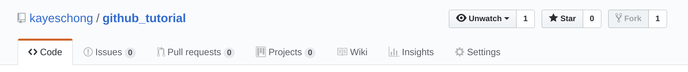
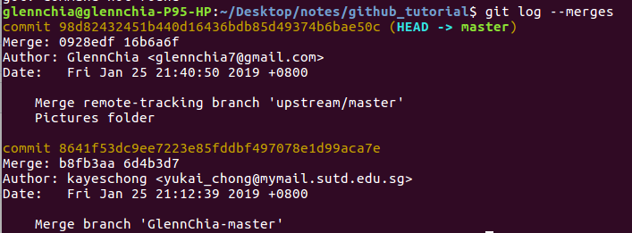

# 1. Starting GitHub

Installing git 

```
$ sudo apt-get update
$ sudo apt-get install git-core 
$ git -- version 
```

Configuring the user details 

```
$ git config --global user.name "FIRST_NAME LAST_NAME"
$ git config --global user.email "MY_NAME@example.com"
```

View the configuration (must be in the home directory)

```
$ nano ~/.gitconfig
```

# 2. Creating a local repository (Owner)

```
$ git init 
$ touch github_notes.md
```

# 3. Link the local repository to GitHub

1. Get the URL from GitHub Copy the URL from "Clone or Download"

2. Link it in command line

   ```
   $ git clone <url>
   ```

# 4. Add, Push Commit 

1. Once the folder has been edited (Example:Edit a file, add a file etc.). This adds all files 

   ```
   $ git add -A
   ```

2. Next we want to preview the files that have been changed. At this point, it shows the files that have yet to be committed 

   ```
   $ git status
   ```

3. Then we want to commit the changes 

   ```
   $ git commit -m "First Commit"
   ```

4. Lastly we want to push 

   ```
   $ git push origin master 
   ```

# 5. Collaborating on GitHub 

## 5.1 Becoming a collaborator 

1. The owner adds you as a collaborator. On the owner's side, repository-> Settings-> Collaborators-> Add collaborators  
2. On the collaborator side, once accepted, git clone the repository and pull from the repository 
3. Subsequently, make the changes and push to github 

## 5.2 Public perspective: Forking 

1. Fork the Repo from the owner's repository
 
2. Git clone the repository. We do not have to create a folder and then git clone in there. This means that if I have a notes folder, I want github_tutorial to be the subfolder. I do not have to create a folder called github_tutorial and clone in there as doing so will create a github_tutorial folder in the github_tutorial folder. Hence, just clone it in the notes folder 

## 5.3 Owner accepting changes

1. Check for pull requests from other people
2. Checkout to their branch, pull and view the changes
3. After confirming edits, checkout back to master and merge changes

## 5.4 Collaborator continue adding changes

1. git remote add upstream (url), to link to main repo
2. git fetch upstream, creates a new branch for incoming data and pulls
3. git merge upstream/master, merge local changes with incoming data
4. git log -- merges. This shows the changes made after merging with the owner's master. This also shows the message that was posted 
